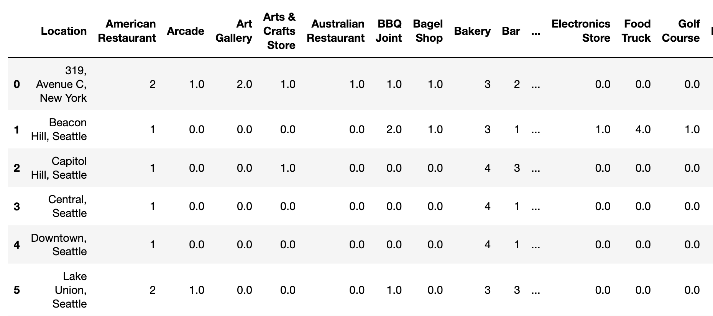

# Applied Data Science Capstone Project Report

## Introduction
The use case is simple. Our customer has to relocate from Manhattan to Seattle beacuse of job. They love their current residence at 319, Avenue C, New York and were wondering if they could find a similar locality in Seattle.

They have a list of areas they are considering in Seattle based on recommendations by friends. 

The goal of this project is to help find our customer areas in Seattle that are similar in terms of attractions nearby to their current residency in Manhattan.

## Data

To achieve this we:
  1. Locate the users home address.
  2. Find all attractions nearby thir current home using the [FourSquare Developer API](https://developer.foursquare.com/).
  3. Similarly, find all attractions near each area the user is considering in Seattle.
  4. Cluster the areas by using unsupervised K-means clustering.
  5. Find the cluster which contains their current home address and recommend areas similar in Seattle.
  
 To make things more interesting we will be using the [GeoPy](https://geopy.readthedocs.io/en/) library to find the geographical co-ordinates of all these places and plotting them on a map using [Folium](https://python-visualization.github.io/folium/)!

For example, after getting all the nearby attractions of the customer's home we get a table like this which contains the attraction name and the attraction category.

When this is repeated for all areas including the ones in Seattle, we get a table like this,  after summing all the attraction categories.

